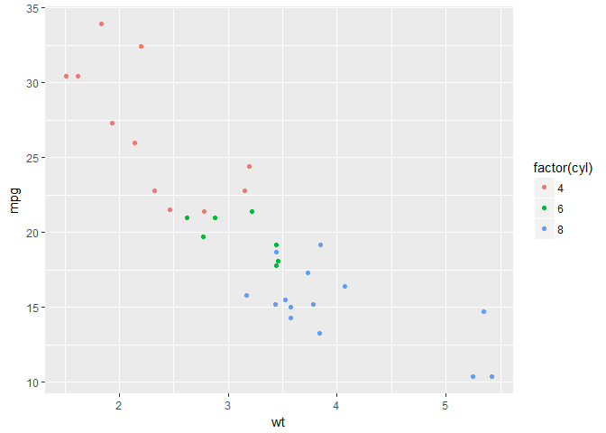

# ggplot2
22 December 2016  

ggplot2 is awesome. 
The following notes are not a comprehensive guide to using it, but instead are reminders on how to do certain tricky things for future reference. 
The official user guides are [here](http://docs.ggplot2.org/current/)
and the [ggplot2 cookbook](http://www.cookbook-r.com/Graphs/) is also excellent.

## Creating graphs

### The basics

Creating a graph is a little different in ggplot compared to anything else I've tried. 
One first sets the data and variables to be used in a graph, then adds the plotting method, the 'geoms' separately. 
A basic plot would look something like this


```r
library(ggplot2)
```

```
## Warning: package 'ggplot2' was built under R version 3.3.2
```

```r
data(mtcars)
p <- ggplot(data = mtcars, aes(x = wt, y = mpg, colour = cyl)) + 
  geom_point()
p
```

<!-- -->

### Grouping

If one has collapsed data and one wants to plot separate lines by a second factor, then need to set group in the plot. 
To set multiple factors as a grouping, then use group = interaction(factor1, factor2).


```r
p <- ggplot(df, aes(x = x_var, y = y_var, group = group_var)) + 
  geom_line()
```
or 


```r
p <- ggplot(df, aes(x = x_var, y = y_var, 
                    group = interaction(g_var_1, g_var_2))) + 
  geom_line()
```

### Rotating axis labels

```r
p + theme(axis.text.x = element_text(angle = 90, hjust = 1, vjust = 0.5))
```

<!-- -->

`hjust` sets the alignment of the text left (`hjust=0`) or right (`hjust=1`) and `vjust` the vertical justification where `vjust = 0` means that the text is justified to the bottom of the text, and `vjust = 1` from the top. 

### Setting the aspect ratio

```r
p + theme(aspect.ratio=1)
```

<!-- -->

### Set axes to zero
ggplot axes don't tend to originate at zero. 


```r
p + expand_limits(x = 0, y = 0)
```

<!-- -->

### Display panelled graphs

with `facet_wrap()` or `facet_grid()`


```r
p + facet_wrap( ~ cyl)
```

<!-- -->

## Manipulating legends

### Position at bottom of graph

```r
p + theme(legend.position = "bottom")
```

<!-- -->

### Postion in graph area
In the top right corner, orientated by the top right corner of the legend box.


```r
p + theme(legend.position = c(1,1), legend.justification = c(1,1))
```

<!-- -->

### Set number of rows in a legend


```r
p + guides(col = guide_legend(nrow = 2))
```

<!-- -->

### Wrapping legend labels

This won't show anything different for this example, but if long strings were used as labels, then these would be wrapped after 13 characters rather than allowed to over plot other points. 

```r
p <- ggplot(data = mtcars, aes(x = wt, y = mpg, colour = factor(cyl))) + 
  geom_point()
p + scale_color_discrete(labels = function(x) strwrap(x, width = 13))
```

<!-- -->

## Manipulating strings

###  Italics in labels
Typically species names need to be italicised, this can be a serious nuisance. Italics can be controlled by the `theme()` function.

```r
theme( axis.test.x = element_text(face = 'italic'))
```
`strip.text.x` controls the horizontal labels of facets. 
Legend text can be controlled as below, assuming that multiple lines have been coloured by a third factor.

```r
scale_colour_discrete("Organism", breaks = c("One", "Two", "Three"), 
    labels = expression(italic("One"), italic("Two"), italic("Three")))
```

Partial italics can be introduced with expression and paste from plotmath:

```r
 ggtitle(expression(paste("Resistance to selected antibiotics in ", italic("E. coli"), " by local area team" )))
```

Adding newlines is harder as plotmath does not allow newline characters. There is a workaround:

```r
ggtitle(
    expression(
        atop(paste("Resistance to selected antibiotics in ", italic("E. coli")),
            " by local area team, England 2013")
    ))
```

### Set the order of labels in a legend

```r
p + guides(colour = guide_legend(reverse = TRUE))
```

<!-- -->

### Other special characters on graphs
Say you want to add special characters, like equality symbols. 

```r
scale_x_discrete("Age group", labels = c("<1 month", "1-11 months", "1-4 years", "5-9 years", 
                                           "10-14 years", "15-44 years", "45-64 years", "65-74 years", 
                                           expression(phantom(x) >=75), "Unknown"))
```
`?phantom` provides a list of other special characters. 

I recently wanted to include regression coefficients and p values on a `facet_wrap()` panelled plot of linear regressions. 
That was an enormous pain in the backside. 
I found the solution [here](http://stackoverflow.com/questions/17022553/adding-r2-on-graph-with-facets), but couldn't get commas to work. 
I did find that the solution in the link resulted in over-plotting all the coefficients. 
My solution was to join df2 into the main plotting data frame. 
I'll try to add an example later. 

It is also possible to use unicode characters to produce special characters. 

```r
labels = c("\u2264 15", "15-20", "20-24","25-30")
```
<= is `\u2264` and >= is `\u2265`

### Labels on axes

To format 10000 as 10 000.

```r
french = function(x) format(x, big.mark = " ")
ggplot()...
     scale_y_continuous("n cases", labels = french)
```

## Manipulating colours

### Setting manual colours
I think the package `viridis` provides really nice colour schemes.
Others, however, disagree and one may need to set these manually.
There's a nice SO post [here](http://stackoverflow.com/questions/26287864/picking-individual-colours-from-a-rcolorbrewer-palette-as-a-scale-colour-manual) on using `Rcolorbrewer` package to create colour schemes.

```r
# Create a colour palette
my_palette = c(brewer.pal(5, "Blues")[c(1,3,4,5)]
# Examine the palette
grid::grid.raster(my_palette, int=F)
# Get the hex values for each of the colours
my_palette 
[1] "#EFF3FF" "#C6DBEF" "#9ECAE1" "#6BAED6" "#3182BD" "#08519C" # not correct, but copy and paste from another job
# Put these into a scale_colour_manual() function
p + scale_colour_manual("scale name", values = c("#EFF3FF", "#C6DBEF", "#9ECAE1", "#6BAED6", "#3182BD", "#08519C"))
```

## Saving plots

```r
svg(filename = "plot.svg")
p
dev.off()
```

Also, have yet to try this, but looks useful. [ggplot-powerpoint-wall-head-solution](http://mcfromnz.wordpress.com/2013/09/03/ggplot-powerpoint-wall-head-solution/). 
Important note re saving plots: `devSVG()` does not handle `<` characters. Base function `svg()` does. 
Or also:

```r
ggsave(filename = "filename.extension", plot, width = 7, height = 4, dpi = 300)
```
It's also worth noting that `dingbats = FALSE` may reduce file size and prevent editors from getting upset.

## Titles, captions and cross-references
### ggplot2
ggplot supports titles, subtitles and footnotes (called captions). 
Title defaults to centre justification, subtitle to left and caption to right. 
This can be overridden with `theme()` as below.

```r
p <- ggplot(mtcars, aes(x = wt, y = mpg)) + 
  geom_point() + 
  labs(title = "My title", 
       subtitle = "My subtitle", 
       caption = "This is a caption") + 
  theme(
    plot.title = element_text(hjust = -0.0),
    plot.caption = element_text(hjust = -0.0)
  )
p
```

<!-- -->

### Markdown/knitr
### captioner package

## Publication quality graphics

Possibly useful for powerpoint

```r
options(bitmapType=”cairo”)
ggsave(“test_ggsave_300.png”, width=14.11, height=14.11, unit=”cm”, dpi=300)
```

from https://mcfromnz.wordpress.com/2013/09/03/ggplot-powerpoint-wall-head-solution/#comment-487

## Maps
