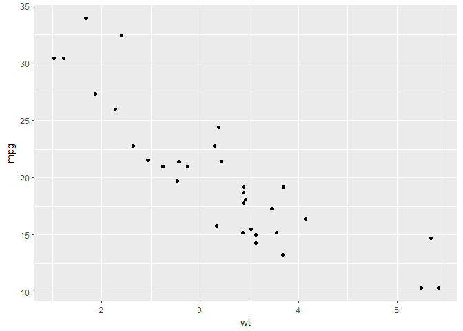
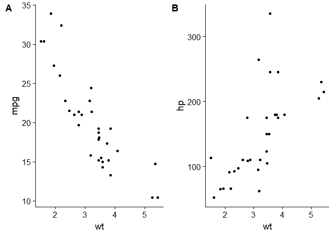
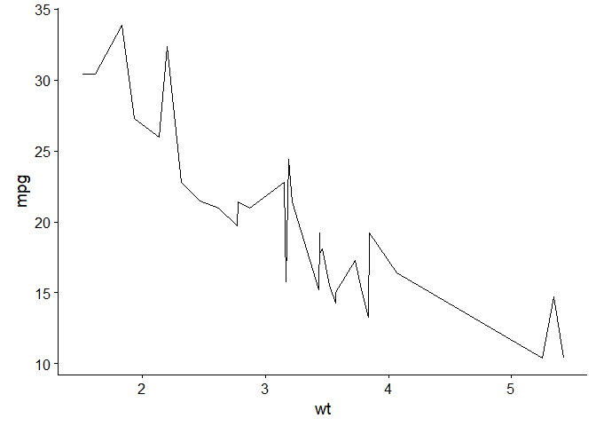
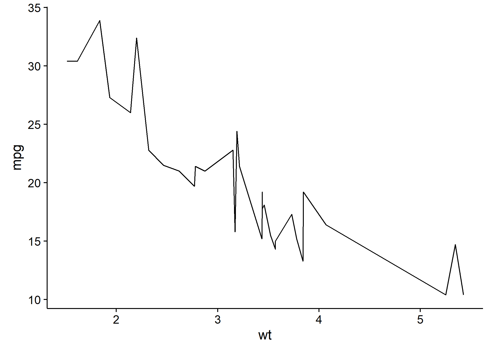

# report production in R

Rmarkdown is great; it mixes plain text, employs markdown formatting with R script to output documents to pdf (with LaTeX), Word or markdown documents. 
Unfortunately, it doesn't quite do everything I need out of the box. 
There are a few things that I need for full solution for preparing full research documents: 

 * cross-referenced tables and figures
 * an easy way to go from regression models to tables
 * good tables
 
## Cross referencing
 
The captioner package creates nice captions which can be cross-referenced in text. 
 First, one creates an object to hold the captions. 
 The captions are then added to the object. 
 Finally, captions are called at the same point as the table or figure. 
 
 
 ```r
 library(captioner)
 fig_nums <- captioner(prefix = "Figure")
 fig_nums(name = "plot1", "A caption describing the plot")
 ```
 
 ```
 ## [1] "Figure  1: A caption describing the plot"
 ```

The caption can then be printed by calling the object. 

`fig_nums("plot1")`

**Figure  1: A caption describing the plot**

```r
data(mtcars)
library(ggplot2)
p <- ggplot(data = mtcars, aes(x = wt, y = mpg)) + geom_point()
p
```

<!-- -->

It can also be used inline, e.g. 

> As shown in `r fig_nums("plot1")`

## Going from regression models to table output

Normal regression model outputs don't give particularly nice outputs that can easily be used in a report. 


```r
data(infert)
head(infert)
```

```
##   education age parity induced case spontaneous stratum pooled.stratum
## 1    0-5yrs  26      6       1    1           2       1              3
## 2    0-5yrs  42      1       1    1           0       2              1
## 3    0-5yrs  39      6       2    1           0       3              4
## 4    0-5yrs  34      4       2    1           0       4              2
## 5   6-11yrs  35      3       1    1           1       5             32
## 6   6-11yrs  36      4       2    1           1       6             36
```

```r
m1 <- glm(case ~ spontaneous + stratum + parity, data = infert, family = "binomial")
m1
```

```
## 
## Call:  glm(formula = case ~ spontaneous + stratum + parity, family = "binomial", 
##     data = infert)
## 
## Coefficients:
## (Intercept)  spontaneous      stratum       parity  
##   -0.626993     1.255312    -0.006535    -0.288837  
## 
## Degrees of Freedom: 247 Total (i.e. Null);  244 Residual
## Null Deviance:	    316.2 
## Residual Deviance: 279 	AIC: 287
```

I used to have a really slow way of accessing the components of the model to go to a useful output. 
Broom made things much easier:


```r
library(broom)
tidy(m1, exponentiate = TRUE, conf.int = TRUE)
```

```
##          term  estimate   std.error statistic      p.value  conf.low
## 1 (Intercept) 0.5341956 0.438123690 -1.431087 1.524052e-01 0.2234415
## 2 spontaneous 3.5089314 0.221620511  5.664239 1.476784e-08 2.3022730
## 3     stratum 0.9934862 0.006413124 -1.019019 3.081940e-01 0.9809588
## 4      parity 0.7491344 0.138150300 -2.090743 3.655108e-02 0.5656926
##   conf.high
## 1 1.2555246
## 2 5.5043957
## 3 1.0060144
## 4 0.9747095
```

At this point one could export to csv, format a table in Excel and copy-paste to Word.
However, that would fail to make full use of the potential of Rmarkdown. 
There's a function in knitr called kable, and this can produce simple tables. 
Unfortunately, they are too simple for my needs.
I favour pixiedust, which does almost everything I need it to.


```r
library(pixiedust)
```

```
## Additional documentation is being constructed at http://nutterb.github.io/pixiedust/index.html
```

```r
library(dplyr)
```

```
## 
## Attaching package: 'dplyr'
```

```
## The following objects are masked from 'package:stats':
## 
##     filter, lag
```

```
## The following objects are masked from 'package:base':
## 
##     intersect, setdiff, setequal, union
```

```r
m1 %>% tidy(exponentiate = TRUE, conf.int = TRUE) %>%
  select(term, estimate, conf.low, conf.high, p.value) %>%
  dust() %>%
  sprinkle(cols = c("term", "estimate", "conf.low", "conf.high"), 
           round = 2) %>%
  sprinkle(rows = 1, border = c("top")) %>%
  sprinkle(rows = 4, border = c("bottom")) %>%
  sprinkle(cols = "p.value", fn = quote(pvalString(value))) %>% 
  sprinkle_colnames(term = "Term", p.value = "P-value") %>%
  sprinkle_print_method("markdown")
```


|Term        | estimate| conf.low| conf.high| P-value|
|:-----------|--------:|--------:|---------:|-------:|
|(Intercept) |     0.53|     0.22|      1.26|    0.15|
|spontaneous |     3.51|      2.3|       5.5| < 0.001|
|stratum     |     0.99|     0.98|      1.01|    0.31|
|parity      |     0.75|     0.57|      0.97|   0.037|


<br>


<br>

The [vignette](https://cran.r-project.org/web/packages/pixiedust/vignettes/pixiedust.html) has further details. 
In addition, pixiedust has a nice method for inline estimates. 
`r dust_inline(m1, term = "spontaneous", label = "OR", fun = exp)`

Which renders:
Spontaneous abortions were associated with increasing odds of infertility (OR = 3.51; 95% CI: 2.3 - 5.5; P < 0.001)

## Publication quality graphs

Graphs out of ggplot2 are almost perfect, however there are a few places in which they fall short:

 1. Antialiasing - not available in ggplot2 so some lines can appear jagged
 1. Arranging multiple graphs in a single figure

Cowplot provides a nice way of arranging figures in grids and also provides an attractive and professional looking theme. 


```r
library(cowplot)
```

```
## 
## Attaching package: 'cowplot'
```

```
## The following object is masked from 'package:ggplot2':
## 
##     ggsave
```

```r
p <- ggplot(data = mtcars, aes(x = wt, y = mpg)) + geom_point()
q <- ggplot(data = mtcars, aes(x = wt, y = hp)) + geom_point()
z <- plot_grid(p,q, labels = c("A", "B"))
z
```

<!-- -->

Cairo adds the ability to export with antialiasing

```r
library(knitr)
opts_chunk$set(dev="png", 
               dev.args=list(type="windows"),
               dpi=300)
p <- ggplot(data = mtcars, aes(x = wt, y = mpg)) + geom_line()
p
```

<!-- -->


```r
library(Cairo)
opts_chunk$set(dev="png", 
               dev.args=list(type="cairo"),
               dpi=300)
library(Cairo)
p
```

<!-- -->
