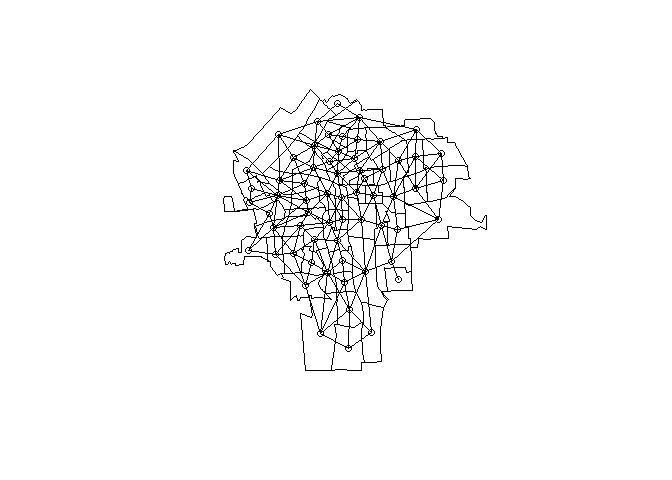
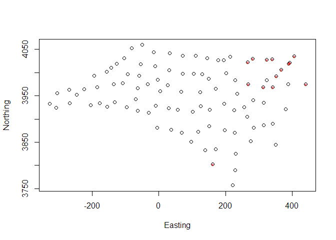

---
exclude: true
--- 

* TOC
{:toc}

These are some really basic notes on spatial statistics, made as I read Applied Spatial Data Analysis with R, by R. S. Bivand *et al*.

## General approach

 1. Create a neighbour list
 1. Create neighbour weights
 1. Investigate spatial autocorrelation
 1. Investigate heterogeneity
 1. Model for clusters
 1. Map clusters
 
## Examining the data

 * `Z` log-trandformed rate
 * `PCTOWNHOME` percent population owning own home
 * `PCTAGE65P` percent population age >/= 65
 * `PEXPOSURE` inverse distance to closest TCE site (Trichloroethane)


```r
# stupid, stupid, stupid win10
library(sp)
library(spdep) # for read.gal
```

```
## Loading required package: Matrix
```

```r
library(rgdal)
```

```
## rgdal: version: 1.2-7, (SVN revision 660)
##  Geospatial Data Abstraction Library extensions to R successfully loaded
##  Loaded GDAL runtime: GDAL 2.0.1, released 2015/09/15
##  Path to GDAL shared files: C:/Users/simon.thelwall/Documents/R/win-library/3.4/rgdal/gdal
##  Loaded PROJ.4 runtime: Rel. 4.9.2, 08 September 2015, [PJ_VERSION: 492]
##  Path to PROJ.4 shared files: C:/Users/simon.thelwall/Documents/R/win-library/3.4/rgdal/proj
##  Linking to sp version: 1.2-4
```

```r
library(DCluster)
```

```
## Loading required package: boot
```

```
## Loading required package: MASS
```

```r
# data from http://asdar-book.org/datasets.php?dataset=15
ny8 <- readOGR(".", "NY8_utm18")
```

```
## OGR data source with driver: ESRI Shapefile 
## Source: ".", layer: "NY8_utm18"
## with 281 features
## It has 17 fields
```

```r
head(ny8, n = 1)
```

```
## An object of class "SpatialPolygonsDataFrame"
## Slot "data":
##          AREANAME     AREAKEY        X        Y POP8 TRACTCAS PROPCAS
## 0 Binghamton city 36007000100 4.069397 -67.3533 3540     3.08 0.00087
##   PCTOWNHOME PCTAGE65P       Z  AVGIDIST PEXPOSURE   Cases       Xm
## 0  0.3277311 0.1466102 0.14197 0.2373852  3.167099 3.08284 4069.397
##         Ym Xshift  Yshift
## 0 -67353.3 423391 4661502
## 
## Slot "polygons":
## [[1]]
## An object of class "Polygons"
## Slot "Polygons":
## [[1]]
## An object of class "Polygon"
## Slot "labpt":
## [1]  422177.8 4662168.3
## 
## Slot "area":
## [1] 899929.7
## 
## Slot "hole":
## [1] FALSE
## 
## Slot "ringDir":
## [1] 1
## 
## Slot "coords":
##           [,1]    [,2]
##  [1,] 421840.4 4662874
##  [2,] 422094.7 4662694
##  [3,] 422308.3 4662569
##  [4,] 422456.2 4662479
##  [5,] 422463.6 4662401
##  [6,] 422487.7 4662334
##  [7,] 422543.4 4662134
##  [8,] 422608.9 4662078
##  [9,] 422699.1 4662010
## [10,] 422789.3 4661942
## [11,] 422871.4 4661886
## [12,] 422879.6 4661875
## [13,] 422978.1 4661807
## [14,] 423000.5 4661585
## [15,] 423000.1 4661551
## [16,] 423015.2 4661418
## [17,] 423006.2 4661351
## [18,] 422899.5 4661430
## [19,] 422833.9 4661475
## [20,] 422743.6 4661543
## [21,] 422661.7 4661611
## [22,] 422579.6 4661667
## [23,] 422489.4 4661735
## [24,] 422407.4 4661802
## [25,] 422317.2 4661870
## [26,] 422235.1 4661926
## [27,] 422227.0 4661937
## [28,] 422144.9 4661994
## [29,] 422054.7 4662061
## [30,] 422021.5 4662051
## [31,] 421963.6 4662051
## [32,] 421947.1 4662052
## [33,] 421864.3 4662041
## [34,] 421773.3 4662042
## [35,] 421781.3 4662020
## [36,] 421682.0 4662010
## [37,] 421599.3 4662011
## [38,] 421475.0 4661990
## [39,] 421445.3 4662290
## [40,] 421437.5 4662335
## [41,] 421430.6 4662457
## [42,] 421423.4 4662557
## [43,] 421555.8 4662567
## [44,] 421655.2 4662577
## [45,] 421746.1 4662576
## [46,] 421862.2 4662608
## [47,] 421855.3 4662730
## [48,] 421840.4 4662874
## 
## 
## 
## Slot "plotOrder":
## [1] 1
## 
## Slot "labpt":
## [1]  422177.8 4662168.3
## 
## Slot "ID":
## [1] "0"
## 
## Slot "area":
## [1] 899929.7
## 
## 
## 
## Slot "plotOrder":
## [1] 1
## 
## Slot "bbox":
##         min       max
## x  421423.4  423015.2
## y 4661351.5 4662874.5
## 
## Slot "proj4string":
## CRS arguments:
##  +proj=utm +zone=18 +ellps=WGS84 +units=m +no_defs
```

```r
# read in neighbour file. 
ny_nb <- read.gal("NY_nb.gal", region.id = row.names(as(ny8, "data.frame")))
class(ny_nb)
```

```
## [1] "nb"
```

```r
head(ny_nb)
```

```
## [[1]]
## [1]  2 13 14 15 47 48 49 50
## 
## [[2]]
## [1]  1  3 13 35 47 48
## 
## [[3]]
## [1]  2 13 35
## 
## [[4]]
## [1]  5  6 35
## 
## [[5]]
## [1]  4  6 10 12
## 
## [[6]]
## [1]  4  5  7 10 35
```
 
The New York data has 281 census tract observations, covering both sparsely populated rural areas and densely populated urban areas.
Cases of leukaemia are recorded by tract. 
 
## Creating a neighbour list

Creates a matrix with one row for each area in data set. 
Demonstrated on a subset of the NY data.
These are contiguity neighbours. 
Areas with adjoining borders are neighbours. 
Other methods are available, such as distance.


```r
syr <- ny8[ny8$AREANAME == "Syracuse city", ]
sy_nb <- poly2nb(syr)
coords <- coordinates(syr) # just for plotting
plot(syr)
plot(sy_nb, coords, add = TRUE)
```

<!-- -->

```r
rm(coords)
```

## Calculating spatial weights

Conversion style `W` by default. 
Weights for each area are standardised to sum to 1


```r
syr_wts <- nb2listw(sy_nb)
syr_wts
```

```
## Characteristics of weights list object:
## Neighbour list object:
## Number of regions: 63 
## Number of nonzero links: 346 
## Percentage nonzero weights: 8.717561 
## Average number of links: 5.492063 
## 
## Weights style: W 
## Weights constants summary:
##    n   nn S0       S1      S2
## W 63 3969 63 24.78291 258.564
```

## Spatial autocorrelation
Using the complete New York data. 
Tests for spatial autocorrelation in number of cases by census tract.
Observe significant spatial autocorrelation, with neighbouring areas having similar values. 


```r
moran.test(ny8$Cases, listw = nb2listw(ny_nb))
```

```
## 
## 	Moran I test under randomisation
## 
## data:  ny8$Cases  
## weights: nb2listw(ny_nb)  
## 
## Moran I statistic standard deviate = 3.9778, p-value = 3.477e-05
## alternative hypothesis: greater
## sample estimates:
## Moran I statistic       Expectation          Variance 
##       0.146882990      -0.003571429       0.001430595
```

## Simultaneous autoregressive models
Uses a regression on values from other areas to account for spatial dependence. 


```r
# spautolm() from spdep
ny_sar <- spautolm(Z ~ PEXPOSURE + PCTAGE65P + PCTOWNHOME, data = ny8, 
                   listw = nb2listw(ny_nb, style = "B"))
summary(ny_sar)
```

```
## 
## Call: 
## spautolm(formula = Z ~ PEXPOSURE + PCTAGE65P + PCTOWNHOME, data = ny8, 
##     listw = nb2listw(ny_nb, style = "B"))
## 
## Residuals:
##      Min       1Q   Median       3Q      Max 
## -1.56754 -0.38239 -0.02643  0.33109  4.01219 
## 
## Coefficients: 
##              Estimate Std. Error z value  Pr(>|z|)
## (Intercept) -0.618193   0.176784 -3.4969 0.0004707
## PEXPOSURE    0.071014   0.042051  1.6888 0.0912635
## PCTAGE65P    3.754200   0.624722  6.0094 1.862e-09
## PCTOWNHOME  -0.419890   0.191329 -2.1946 0.0281930
## 
## Lambda: 0.040487 LR test value: 5.2438 p-value: 0.022026 
## Numerical Hessian standard error of lambda: 0.017192 
## 
## Log likelihood: -276.1069 
## ML residual variance (sigma squared): 0.41388, (sigma: 0.64333)
## Number of observations: 281 
## Number of parameters estimated: 6 
## AIC: 564.21
```

Lambda = 0.04, p = 0.02 indicates significant spatial correlation in residuals. 

Alternatively, can weight by population of census tracts:
(not currently run as I don't know where POPS came frome)

```r
ny_lm <- lm(Z ~ PEXPOSURE + PCTAGE65P + PCTOWNHOME, data = ny8, 
                   weights = POP8)
summary(ny_lm)
```

```
## 
## Call:
## lm(formula = Z ~ PEXPOSURE + PCTAGE65P + PCTOWNHOME, data = ny8, 
##     weights = POP8)
## 
## Weighted Residuals:
##      Min       1Q   Median       3Q      Max 
## -129.067  -14.714    5.817   25.624   70.723 
## 
## Coefficients:
##             Estimate Std. Error t value Pr(>|t|)    
## (Intercept) -0.77837    0.14116  -5.514 8.03e-08 ***
## PEXPOSURE    0.07626    0.02731   2.792  0.00560 ** 
## PCTAGE65P    3.85656    0.57126   6.751 8.60e-11 ***
## PCTOWNHOME  -0.39869    0.15305  -2.605  0.00968 ** 
## ---
## Signif. codes:  0 '***' 0.001 '**' 0.01 '*' 0.05 '.' 0.1 ' ' 1
## 
## Residual standard error: 33.5 on 277 degrees of freedom
## Multiple R-squared:  0.1977,	Adjusted R-squared:  0.189 
## F-statistic: 22.75 on 3 and 277 DF,  p-value: 3.382e-13
```

Can also use population weights in a `spautolm` model

```r
ny_sar2 <- spautolm(Z ~ PEXPOSURE + PCTAGE65P + PCTOWNHOME, data = ny8, 
                   listw = nb2listw(ny_nb, style = "B"), weights = POP8)
summary(ny_sar2)
```

```
## 
## Call: 
## spautolm(formula = Z ~ PEXPOSURE + PCTAGE65P + PCTOWNHOME, data = ny8, 
##     listw = nb2listw(ny_nb, style = "B"), weights = POP8)
## 
## Residuals:
##      Min       1Q   Median       3Q      Max 
## -1.48488 -0.26823  0.09489  0.46552  4.28343 
## 
## Coefficients: 
##              Estimate Std. Error z value  Pr(>|z|)
## (Intercept) -0.797063   0.144054 -5.5331 3.146e-08
## PEXPOSURE    0.080545   0.028334  2.8428  0.004473
## PCTAGE65P    3.816731   0.576037  6.6258 3.453e-11
## PCTOWNHOME  -0.380778   0.156507 -2.4330  0.014975
## 
## Lambda: 0.0095636 LR test value: 0.32665 p-value: 0.56764 
## Numerical Hessian standard error of lambda: 0.016529 
## 
## Log likelihood: -251.6017 
## ML residual variance (sigma squared): 1104.1, (sigma: 33.229)
## Number of observations: 281 
## Number of parameters estimated: 6 
## AIC: 515.2
```
Interesting results from this. 
There is no longer spatial autocorrelation, and proximity to TCE site is now significant.
Lower AIC values indicate better model fits. 

## Conditional autoregressive models
Conditional distribution of spatial error terms. 
Only spatial errors of neighbours are used, rather than all spatial errors. 


```r
ny_car <- spautolm(Z ~ PEXPOSURE + PCTAGE65P + PCTOWNHOME, data = ny8, 
                   listw = nb2listw(ny_nb, style = "B"), weights = POP8, 
                   family = "CAR")
summary(ny_car)
```

```
## 
## Call: 
## spautolm(formula = Z ~ PEXPOSURE + PCTAGE65P + PCTOWNHOME, data = ny8, 
##     listw = nb2listw(ny_nb, style = "B"), weights = POP8, family = "CAR")
## 
## Residuals:
##       Min        1Q    Median        3Q       Max 
## -1.491042 -0.270906  0.081435  0.451556  4.198134 
## 
## Coefficients: 
##              Estimate Std. Error z value  Pr(>|z|)
## (Intercept) -0.790154   0.144862 -5.4545 4.910e-08
## PEXPOSURE    0.081922   0.028593  2.8651  0.004169
## PCTAGE65P    3.825858   0.577720  6.6223 3.536e-11
## PCTOWNHOME  -0.386820   0.157436 -2.4570  0.014010
## 
## Lambda: 0.022419 LR test value: 0.38785 p-value: 0.53343 
## Numerical Hessian standard error of lambda: 0.038928 
## 
## Log likelihood: -251.5711 
## ML residual variance (sigma squared): 1102.9, (sigma: 33.21)
## Number of observations: 281 
## Number of parameters estimated: 6 
## AIC: 515.14
```


## Calculating expected cases
 1. Calculate the overall rate
 1. Multiply population at geographical unit by rate to get expected cases at geographical unit (p. 314)
 
## Detecting clusters of disease


```r
rm(list = ls())
data("nc.sids")
ls()
```

```
## [1] "nc.sids"   "ncCC89.nb" "ncCR85.nb" "sidscents" "sidspolys"
```

```r
class(nc.sids)
```

```
## [1] "data.frame"
```

```r
head(nc.sids)
```

```
##             CNTY.ID BIR74 SID74 NWBIR74 BIR79 SID79 NWBIR79 east north
## Ashe           1825  1091     1      10  1364     0      19  164   176
## Alleghany      1827   487     0      10   542     3      12  183   182
## Surry          1828  3188     5     208  3616     6     260  204   174
## Currituck      1831   508     1     123   830     2     145  461   182
## Northampton    1832  1421     9    1066  1606     3    1197  385   176
## Hertford       1833  1452     7     954  1838     5    1237  411   176
##                  x       y       lon      lat L.id M.id
## Ashe        -81.67 4052.29 -81.48594 36.43940    1    2
## Alleghany   -50.06 4059.70 -81.14061 36.52443    1    2
## Surry       -16.14 4043.76 -80.75312 36.40033    1    2
## Currituck   406.01 4035.10 -76.04892 36.45655    1    4
## Northampton 281.10 4029.75 -77.44057 36.38799    1    4
## Hertford    323.77 4028.10 -76.96474 36.38189    1    4
```

Functions used later in this process have absolute requirements for two columns:
`Observed` and `Expected`. 

This next process calculates these values

```r
nc.sids$Observed <- nc.sids$SID74
nc.sids$Population <- nc.sids$BIR74
r <- sum(nc.sids$Observed) / sum(nc.sids$Population)
nc.sids$Expected <- nc.sids$Population * r
nc.sids$smr <- nc.sids$Observed/nc.sids$Expected
```

 1. First test homogeneity of relative risks
  * Chisq test for differences between expected and observed values as above. `DCluster::achisq.test()`

Requires a data frame for input. 
If you are using a spatialpoly, you can use `as(poly_name, "data.frame")
or `poly_name@data`


```r
DCluster::achisq.test(Observed ~ offset(log(Expected)),
            data = nc.sids, model = "multinom", 999)
```

```
## Chi-square test for overdispersion 
## 
## 	Type of boots.: parametric 
## 	Model used when sampling: Multinomial 
## 	Number of simulations: 999 
## 	Statistic:  225.5723 
## 	p-value :  0.001
```

There is significant evidence of overdispersion. 


```r
DCluster::pottwhitt.test(Observed ~ offset(log(Expected)),
            data = nc.sids, model = "multinom", 999)
```

```
## Potthoff-Whittinghill's test of overdispersion 
## 
## 	Type of boots.: parametric 
## 	Model used when sampling: Multinomial 
## 	Number of simulations: 999 
## 	Statistic:  527848.8 
## 	p-value :  0.001
```

## Tango's test of global clustering


```r
coords <- cbind(nc.sids$x, nc.sids$y)
dlist <- dnearneigh(coords, 0, Inf)
dlist <- include.self(dlist)
dlist.d <- nbdists(dlist, coords = coords)
phi <- 100
col.W.tango <- nb2listw(dlist, 
                        glist = lapply(dlist.d, 
                                       function(x, phi){
                          exp(-x/phi)
                        }, phi = phi), style = "C")

DCluster::tango.test(Observed ~ offset(log(Expected)),
           data = nc.sids, model = "negbin", 999, listw = col.W.tango, 
           zero.policy = TRUE)
```

```
## Tango's test of global clustering 
## 
## 	Type of boots.: parametric 
## 	Model used when sampling: Negative Binomial 
## 	Number of simulations: 999 
## 	Statistic:  0.000483898 
## 	p-value :  0.044
```

## Locating clusters
Using Kulldorf's statistic
`calculate.mle()` requires `Expected` and `Observed` and data as a data.frame


```r
mle <- DCluster::calculate.mle(nc.sids, model = "negbin")
the_grid <- nc.sids[, c("x", "y")] # another data.frame
knresults <- DCluster::opgam(data = nc.sids, thegrid = the_grid, alpha = 0.05,
                   iscluster = DCluster::kn.iscluster, 
                   fractpop = 0.15, # fraction of total population to use
                   R = 99, # Number of repetitions for bootstrapping
                   model = "negbin", mle = mle)
knresults
```

```
##                  x       y  statistic cluster pvalue size
## Currituck   406.01 4035.10  11269.293       1   0.04   25
## Northampton 281.10 4029.75 182768.987       1   0.02    7
## Hertford    323.77 4028.10  39205.468       1   0.01    7
## Camden      392.64 4021.10   9653.832       1   0.03   26
## Gates       340.22 4029.13  10512.742       1   0.03   22
## Halifax     266.13 4022.30  67148.419       1   0.02   20
## Pasquotank  389.33 4019.59   9653.832       1   0.01   26
## Perquimans  366.08 4005.86   9653.832       1   0.02   26
## Chowan      351.02 3991.89  28388.070       1   0.02   27
## Edgecombe   268.32 3975.38 687490.572       1   0.02   16
## Martin      312.68 3968.99 186997.037       1   0.02   16
## Washington  340.68 3968.14  10556.975       1   0.03   27
## Dare        439.65 3975.36   8241.024       1   0.01   25
## Columbus    161.28 3802.49 124587.391       1   0.04    3
```

### Plot clusters


```r
#Plot centroids
plot(nc.sids$x, nc.sids$y, xlab="Easting", ylab="Northing")
#Plot points marked as clusters
points(knresults$x, knresults$y, col="red", pch="*")
```

<!-- -->
