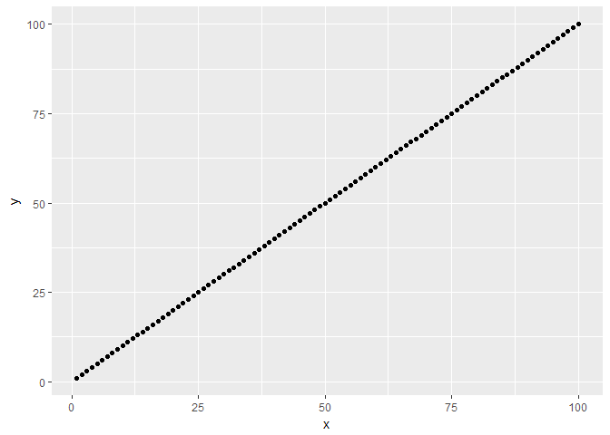
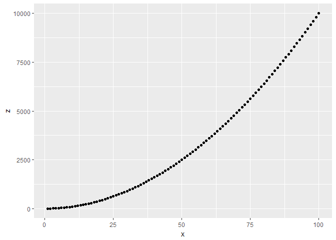

# Statistics

* TOC
{:toc}

## Simple stats

### Percentiles

``` r
data(mtcars)
quantile(mtcars$mpg, c(0.25, 0.5, 0.75), na.rm = TRUE)
```

    ##    25%    50%    75% 
    ## 15.425 19.200 22.800

### Chi-sq test

Make a contingency table and nest inside `chisq.test()`

``` r
data(infert) # built in fertility data
head(infert)
```

    ##   education age parity induced case spontaneous stratum pooled.stratum
    ## 1    0-5yrs  26      6       1    1           2       1              3
    ## 2    0-5yrs  42      1       1    1           0       2              1
    ## 3    0-5yrs  39      6       2    1           0       3              4
    ## 4    0-5yrs  34      4       2    1           0       4              2
    ## 5   6-11yrs  35      3       1    1           1       5             32
    ## 6   6-11yrs  36      4       2    1           1       6             36

``` r
table(infert$education, infert$case)#
```

    ##          
    ##            0  1
    ##   0-5yrs   8  4
    ##   6-11yrs 80 40
    ##   12+ yrs 77 39

``` r
chisq.test(table(infert$education, infert$case))
```

    ## Warning in chisq.test(table(infert$education, infert$case)): Chi-squared
    ## approximation may be incorrect

    ## 
    ##  Pearson's Chi-squared test
    ## 
    ## data:  table(infert$education, infert$case)
    ## X-squared = 0.0022896, df = 2, p-value = 0.9989

The Chi square test results in a warning message because the cell case-0-5yrs is &lt; 5. Best to check with Fisher's exact test:

``` r
fisher.test(table(infert$education, infert$case))
```

    ## 
    ##  Fisher's Exact Test for Count Data
    ## 
    ## data:  table(infert$education, infert$case)
    ## p-value = 1
    ## alternative hypothesis: two.sided

It's possible to get the observed and expected cell counts from the output of a `chisq.test()`:

``` r
chisq.test(table(infert$education, infert$case))$expected
```

    ## Warning in chisq.test(table(infert$education, infert$case)): Chi-squared
    ## approximation may be incorrect

    ##          
    ##                   0         1
    ##   0-5yrs   7.983871  4.016129
    ##   6-11yrs 79.838710 40.161290
    ##   12+ yrs 77.177419 38.822581

## Mantel-Haenzsel

It pains me to say it, but I don't think the output from R for MH analysis is as neat as that from Stata. The package epicalc had a reasonable function, `mhor()`, but has been removed from CRAN.

Base-r has `mantelhaen.test()` which

> Performs a Cochran-Mantel-Haenszel chi-squared test of the null that two nominal variables are conditionally independent in each stratum, assuming that there is no three-way interaction.

However,

> Currently, no inference on homogeneity of the odds ratios is performed.

i.e. there one can't use `mantelhaen.test()` to identify interaction, and the p-values obtained refer to the pooled odds ratio not being equal to one.

``` r
library(epicalc)
data(Oswego)
mhor(Oswego$ill, Oswego$chocolate, Oswego$sex)
```

would return

    Stratified analysis by  Var3 
                    OR lower lim. upper lim. P value
    Var3 F       0.417     0.0617       2.06  0.3137
    Var3 M       0.331     0.0512       1.83  0.2635
    M-H combined 0.364     0.1258       1.05  0.0611

    M-H Chi2(1) = 3.51 , P value = 0.061 
    Homogeneity test, chi-squared 1 d.f. = 0.05 , P value = 0.827 

## Linear regression

``` r
m1 <- lm(mpg ~ wt, data = mtcars)

# Multiple, with ordered categorical varliable
m2 <- lm(mpg ~ wt + factor(cyl), data = mtcars)

# check the results
summary(m1)
```

    ## 
    ## Call:
    ## lm(formula = mpg ~ wt, data = mtcars)
    ## 
    ## Residuals:
    ##     Min      1Q  Median      3Q     Max 
    ## -4.5432 -2.3647 -0.1252  1.4096  6.8727 
    ## 
    ## Coefficients:
    ##             Estimate Std. Error t value Pr(>|t|)    
    ## (Intercept)  37.2851     1.8776  19.858  < 2e-16 ***
    ## wt           -5.3445     0.5591  -9.559 1.29e-10 ***
    ## ---
    ## Signif. codes:  0 '***' 0.001 '**' 0.01 '*' 0.05 '.' 0.1 ' ' 1
    ## 
    ## Residual standard error: 3.046 on 30 degrees of freedom
    ## Multiple R-squared:  0.7528, Adjusted R-squared:  0.7446 
    ## F-statistic: 91.38 on 1 and 30 DF,  p-value: 1.294e-10

``` r
# and get confidence intervals
confint(m1)
```

    ##                 2.5 %    97.5 %
    ## (Intercept) 33.450500 41.119753
    ## wt          -6.486308 -4.202635

The summary provide R2 which gives coefficient of determination, the amount of variance in data explained by regressors. Adjusted R2, adjusts this for number of predictor variables included in model. It should be on the scale 0 to 1. However, plot of fitted values (x axis) against residuals more useful (y axis).

### Departures from linearity

``` r
library(ggplot2)
```

    ## Warning: package 'ggplot2' was built under R version 3.3.2

``` r
test.data <- data.frame(x = seq(1,100,1), y = seq(1,100,1))
test.data$z <- test.data$x^2

qplot(x=x, y=y, data = test.data)
```



``` r
qplot(x=x, y=z, data = test.data)
```



``` r
m1 <- lm(x ~ y, data = test.data)
m2 <- lm(x ~ y + I(y^2), data = test.data)
anova(m1,m2)
```

    ## Analysis of Variance Table
    ## 
    ## Model 1: x ~ y
    ## Model 2: x ~ y + I(y^2)
    ##   Res.Df        RSS Df  Sum of Sq      F  Pr(>F)  
    ## 1     98 5.4155e-27                               
    ## 2     97 5.2558e-27  1 1.5974e-28 2.9482 0.08917 .
    ## ---
    ## Signif. codes:  0 '***' 0.001 '**' 0.01 '*' 0.05 '.' 0.1 ' ' 1

Or by polynomial regression

# Polynomial regression


```r
# linear first
m1 <- lm(wt ~ disp, data = mtcars)
m2 <- lm(wt ~ poly(disp, 2), data = mtcars)
m3 <- lm(wt ~ poly(disp, 3), data = mtcars)
anova(m1, m2)
```

```
## Analysis of Variance Table
## 
## Model 1: wt ~ disp
## Model 2: wt ~ poly(disp, 2)
##   Res.Df    RSS Df Sum of Sq      F Pr(>F)
## 1     30 6.2768                           
## 2     29 6.2748  1 0.0020473 0.0095 0.9232
```

```r
anova(m2, m3)
```

```
## Analysis of Variance Table
## 
## Model 1: wt ~ poly(disp, 2)
## Model 2: wt ~ poly(disp, 3)
##   Res.Df    RSS Df Sum of Sq      F    Pr(>F)    
## 1     29 6.2748                                  
## 2     28 3.0471  1    3.2277 29.659 8.205e-06 ***
## ---
## Signif. codes:  0 '***' 0.001 '**' 0.01 '*' 0.05 '.' 0.1 ' ' 1
```

```r
anova(m1, m3)
```

```
## Analysis of Variance Table
## 
## Model 1: wt ~ disp
## Model 2: wt ~ poly(disp, 3)
##   Res.Df    RSS Df Sum of Sq      F    Pr(>F)    
## 1     30 6.2768                                  
## 2     28 3.0471  2    3.2297 14.839 4.037e-05 ***
## ---
## Signif. codes:  0 '***' 0.001 '**' 0.01 '*' 0.05 '.' 0.1 ' ' 1
```

```r
p <- ggplot(data = mtcars, aes(x = disp, y = wt)) + 
  geom_smooth(method = "lm", formula = y ~ poly(x, 3)) + 
  geom_point()
p
```

<!-- -->


### Obtaining the number of observations from a regression

I can't believe it's taken me this long to discover

``` r
nobs(model)
```

which simple returns the number of observations in a model. Easy.

I haven't tested either of these, but spotted them on the web and wanted to make a note.

``` r
nrow(model.frame(lmObject))
```

or

``` r
length(resid(lmObject))
```

## Hypothesis tests in regression models

I'm putting this here as a note to self because I don't really have anywhere else to put it.

> P-values corresponding to parameter estimates in computer outputs are based on Wald tests. These are directly interpretable for exposure effects that are represented by a single parameter in the regression model. p. 318-319 Kirkwood and Sterne, 2nd Ed.

> Single parameter Walt tests are, however, less useful for a categorical variable, which is represented by a series of indicator variables in the regression model. \[In a regression model for the effect of social class on the rate of myocardial infarction\] Wald p-values are given for each of these five social class groups enabling them to be compared with the baseline. What is needed, however, is a combined test of the null hypothesis that social class has no influence on the rate of myocardial infarction. ... We prefer instead to use likelihood ratio tests. p. 319 Kirkwood and Sterne, 2nd Ed.

## Logistic regression

``` r
data(infert)
m1 <- glm(case ~ induced, data = infert, family = "binomial")
m2 <- glm(case ~ induced + spontaneous, data = infert, family = "binomial")
```

### Likelihood ratio test

One can load the library lmtest, but `anova()` can perform likelihood ratio tests.

``` r
library(lmtest)
```

    ## Loading required package: zoo

    ## 
    ## Attaching package: 'zoo'

    ## The following objects are masked from 'package:base':
    ## 
    ##     as.Date, as.Date.numeric

``` r
lrtest(m2, m1)
```

    ## Likelihood ratio test
    ## 
    ## Model 1: case ~ induced + spontaneous
    ## Model 2: case ~ induced
    ##   #Df  LogLik Df  Chisq Pr(>Chisq)    
    ## 1   3 -139.81                         
    ## 2   2 -158.05 -1 36.487  1.537e-09 ***
    ## ---
    ## Signif. codes:  0 '***' 0.001 '**' 0.01 '*' 0.05 '.' 0.1 ' ' 1

``` r
anova(m2, m1, test = "LRT")
```

    ## Analysis of Deviance Table
    ## 
    ## Model 1: case ~ induced + spontaneous
    ## Model 2: case ~ induced
    ##   Resid. Df Resid. Dev Df Deviance  Pr(>Chi)    
    ## 1       245     279.61                          
    ## 2       246     316.10 -1  -36.487 1.537e-09 ***
    ## ---
    ## Signif. codes:  0 '***' 0.001 '**' 0.01 '*' 0.05 '.' 0.1 ' ' 1

### Conditional logistic regression

``` r
library(survival)
m1 <- clogit(depvar ~ var2 + strata(match_var), data=df)
```

### Getting the odds ratio out

Best achieved with the broom package

``` r
library(broom)
tidy(m2, exponentiate = TRUE, conf.int = TRUE)
```

    ##          term  estimate std.error statistic      p.value  conf.low
    ## 1 (Intercept) 0.1812532 0.2677095 -6.379528 1.776344e-10 0.1046179
    ## 2     induced 1.5191172 0.2056274  2.033432 4.200891e-02 1.0159893
    ## 3 spontaneous 3.3108503 0.2116433  5.656712 1.543004e-08 2.2121059
    ##   conf.high
    ## 1 0.2998809
    ## 2 2.2824458
    ## 3 5.0864647

How I used to do it

``` r
orWrapper<-function(x){
  cbind(OR = exp(coef(x)),
        exp(confint(x)), 
        p_val = round(summary(x)$coefficients[,4],6))
  }
oddsratios <- orWrapper(m1)
```

    ## Waiting for profiling to be done...

### Prediction

There are two approaches to prediction (at least): base-r or broom The broom method is much cleaner and my preference. However, I'm including the old-school approach for reference.
